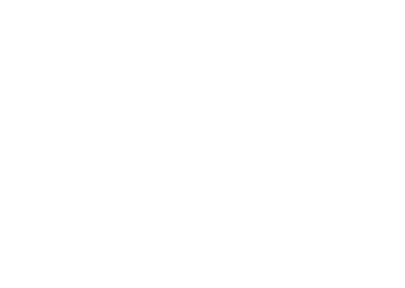
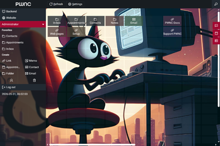
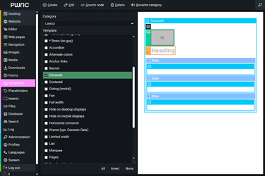
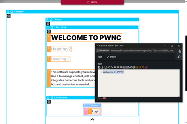

# All-in-One Web OS & IDE (yes, it also has a CMS)

PWNC is a lightweight, zero-dependency PHP/MySQL integrated web development platform with a clean, minimalist interface, providing a comprehensive toolkit for developers and teams to craft and manage websites and web apps efficiently.

**If you're into native web standards coding and want 100/100 PageSpeed, this is for you.**

&ensp;&ensp;

Easy install: Just upload it to your webspace, call `/pwnc`, enter **admin** / **admin** and follow the instructions.

---

## Legal Note

PWNC is source-available, ***not*** open source. While you are free to use and modify the software for your projects (private and commercial) and use the "fork" function to make public copies on GitHub, **public forks of modified versions are prohibited** under the [PWNC Web Platform License](LICENSE.md).

---

## Status

- **Production-Ready**
- **Actively Maintained**
- **Integrated Updates**

---

## Features

### Core Platform & Editing

- **Context-Sensitive WYSIWYG Editor** with multiple editing views: full, layout, content, output
- **Nested Template & Component System** with ready-to-use and fully extensible components
- **Asset & Data Management** for media, downloads, files, and database tables
- **Form Editor** for creating and managing web forms

### Applications & Tools

- **Frontend:** Blog, Forum, Chat, Comment System, RSS Reader, User Registration/Profile Management, Search Engine, ~150 ready-to-use/customizable components
- **Backend:** Editorial System, Solo Webpage Manager, Navigation Manager, Database & File Management, Web Crawler, Logging, Language Configuration, User & Permissions Management, Setup & Updates
- **Web Desktop:** Calendar, Contacts, Notes, Email Client, Instant Messaging, Links

### Performance, Security & Usability

- **SEO & Performance:** XML sitemaps, canonical/alternate links, RSS feeds, responsive image optimization (WebP/JPEG), selective caching, crisp JavaScript without third-party frameworks
- **Security & Stability:** Automatic integrity checks, secure authentication, easy database backup/restore, detailed error reporting, regular one-click updates and full-site ZIP backups, bad bot detection/blocking
- **Usability:** Minimalist, consistent interface optimized for desktop and touchscreen
- **Analytics:** Automatic tracking of page views and user actions, detailed queries, effective bot filtering, privacy-compliant anonymization
- **Additional:** Multilingual support, background task daemon, multisite-ready

---

## Technical Requirements

- PHP ≥ 7.4 (PHP 8.x fully supported)
- MySQL ≥ 5.6 or MariaDB ≥ 10.0
- Modern browser (desktop or tablet recommended)
- Storage: ≥ 500 MB (2 GB+ recommended for media-heavy sites)

---

## Installation

1.  **[Download PWNC](https://github.com/heydev-de/pwnc/archive/main.zip)** as a ZIP file from the official source and extract it on your computer.
2.  Upload the contents of the extracted `pwnc-main` folder into an empty directory on your web server (a clear name like `/domain.tld` is recommended). This will become your website's root folder.
3.  Adjust `.htaccess` and `robots.txt` to match your server environment and website policy.
4.  Point your domain's **document root** to the installation folder. Refer to your hosting provider if needed.
5.  Open `domain.tld/pwnc` in your browser and follow the setup instructions. Default login username: **admin**, password: **admin**.

---

## Updates

After installation, perform updates via the built-in system (*Backend → Setup*) to avoid overwriting data. By default, a full backup of your installation and database is created in `/#update/backup`, while keeping the previous backup.

---

## Quick Start

1.  **Backend login:** `domain.tld/pwnc`
2.  **Update page information:** Go to *Placeholders → Category: Info*.
3.  **Replace branding assets:** Go to *Backend → Images* and replace **Logo**, **Logo alternative**, **Icon**, and **Open graph banner** by selecting *Replace image*. Do not delete/reupload.
4.  **Configure languages:** Go to *Backend → Languages*.
5.  **Set canonical URL (multi-domain sites):** Go to *Backend → Navigation*, select the topmost entry, and set the **Canonical base URL** to your preferred main domain.
6.  **Customer account:** A default user named **Customer** (username: **default**) exists under *Backend → Administration*. Unlock it and set a new password before use.
7.  **Publish site:** Unlock the **Guest** (anonymous) account under *Backend → Administration* to make the site publicly accessible.

---

## Resources

- **Website:** [pwnc.it](https://pwnc.it)
- **API Reference:** [Technical Documentation (Auto-generated)](doc/api/README.md)
- **Source:** [GitHub Repository](https://github.com/heydev-de/pwnc)

---

## Support

- **Community Support:** Available [via forum](https://github.com/heydev-de/pwnc/discussions)
- **Extended Support:** Professional services available [on request](https://webentwicklung-duesseldorf.com/kontakt.php)
- **Feature Requests:** Submitted [through community channels](https://github.com/heydev-de/pwnc/discussions)
- **Issue Reporting:** Available [via GitHub](https://github.com/heydev-de/pwnc/issues)

---

## License

PWNC is provided as **proprietary source-available** software. It is free to use for both private and commercial projects, subject to the following conditions:

- **Commercial Use:** Allowed for custom solutions for individual end clients and specific PWNC extensions.
- **Restrictions:** Redistribution of the code (original or modified) and charging fees for the software itself is strictly prohibited.
- **Attribution:** Original copyright notices and visible credit markings in the user interface must be maintained.

Full terms can be found in the [LICENSE.md](LICENSE.md). Governing law is German law (Jurisdiction: Düsseldorf).

---

PWNC provides a fast, integrated environment for building scalable websites and web apps with minimal footprint and powerful features out of the box.

---

**Legal Notice:** [pwnc.it/legal-info.php](https://pwnc.it/legal-info.php)